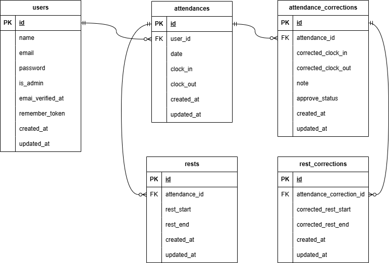

# coachtech 勤怠管理アプリ

シンプルなインターフェースの勤怠管理アプリ（課題）です。

## 環境構築

### Docker ビルド

以下を実行します

1. ```
   git clone git@github.com:torch29/matsumoto-mogikadai2-attendance.git
   ```
2. docker desktop アプリを起動する

3. ```
   docker-compose up -d --build
   ```

### Laravel 環境構築

1. ```
   docker-compose exec php bash
   ```
2. ```
   composer install
   ```
3. `cp .env.example .env` を実行し、.env.example を .env にコピーする。
4. .env ファイルを開き、

   - `DB_HOST=127.0.0.1` を `DB_HOST=mysql` に変更する。
   - DB_DATABASE, DB_USERNAME, DB_PASSWORD を docker-compose.yml と合わせて任意に変更する。  
     （例）
     ```.env
     DB_DATABASE=laravel_db
     DB_USERNAME=laravel_user
     DB_PASSWORD=laravel_pass
     ```

5. ```
   php artisan key:generate
   ```
6. マイグレーションの実行

   ```
   php artisan migrate
   ```

7. シーディングの実行でダミーデータが作られます（下部「シーディング」項目をご参照ください）

   ```
   php artisan db:seed
   ```

8. "The stream or file could not be opened"エラーが発生した場合  
   src ディレクトリにある storage ディレクトリに権限を設定

   ```
   chmod -R 777 storage
   ```

### MailHog の設定

勤怠管理アプリに会員登録する際にメールアドレス認証が必要となります。  
認証用のメールを確認するメールサーバーとして MailHog を使用しています。

1. `docker-compose.yml`に、下記が設定されていることを確認します。

   ```yml
   mailhog:
     image: mailhog/mailhog
     ports:
       - "8025:8025"
       - "1025:1025"
     environment:
       MH_STORAGE: memory
   ```

2. もしも 1. の内容を修正した場合は Docker を再ビルドします。（MailHog のイメージをビルド）

   ```
   docker-compose up -d --build
   ```

3. `.env` ファイルを開き以下の項目を設定します。  
   MAIL_FROM_ADDRESS 欄は、適当なもので OK です。
   ```.env
   MAIL_DRIVER=smtp
   MAIL_HOST=mailhog
   MAIL_PORT=1025
   MAIL_USERNAME=
   MAIL_PASSWORD=
   MAIL_ENCRYPTION=
   MAIL_FROM_ADDRESS=mailhog@mailhog.com
   MAIL_FROM_NAME="${APP_NAME}"
   ```
4. http://localhost:8025 にアクセスして、送信されたメールを確認できます。  
   アプリ内では、会員登録後の「メール認証誘導画面」にあるボタンをクリックでも遷移できます。

### テストの準備と実行

テストを実行するための設定をします。

- ほとんどのテストは PHPUnit によるテストで実行されます。
- 勤怠打刻画面の時刻表示に JavaScript を用いているため、そのテストのために一部 Laravel Dusk を使用しています。

1. MySQL コンテナから、テスト用のデータベースを作成します。

   MySQL コンテナに入り root ユーザでログイン（要パスワード入力）

   ```
   docker-compose exec mysql bash
   ```

   ```
   $ mysql -u root -p
   ```

   ログインできたら、データベース test と dusk_test を作成します。（データベース名は任意です。）

   ```.mysql
   > CREATE DATABASE test;
   > CREATE DATABASE dusk_test;
   > SHOW DATABASES;

   ```

2. PHPUnit テスト用の.env ファイルを作成します。

   PHP コンテナに入り、.env をコピーした .env.testing を作成

   ```
   $ cp .env .env.testing
   ```

   `.env.testing` を開き、文頭の `APP_ENV` と `APP_KEY` を編集します。

   ```.env
   APP_ENV=test
   APP_KEY=
   ```

   さらに、.env.testing にデータベースの接続情報を修正/記述します。

   ```.env
   DB_DATABASE=test
   DB_USERNAME=root
   DB_PASSWORD=root
   ```

3. Laravel Dusk テスト用のファイルを作成・確認します。

   PHP コンテナにて .env.testing をコピーした .env.dusk.local を作成

   ```
   $ cp .env.testing .env.dusk.local
   ```

   `.env.dusk.local` を開き、文頭の `APP_ENV` , `APP_KEY`, `APP_URL` を編集し、`DUSK_DRIVER_URL`を追記します。

   ```.env
   APP_ENV=dusk.local
   APP_KEY=
   APP_URL=http://nginx
   DUSK_DRIVER_URL=http://chromedriver:4444

   ```

   さらに、.env.dusk.local にデータベースの接続情報を修正/記述します。

   ```.env
   DB_DATABASE=dusk_test
   DB_USERNAME=root
   DB_PASSWORD=root
   ```

   docker-compose.yml に下記の設定が記載されていることを確認。なければ追記します。

   ```yml
   chromedriver:
     image: seleniarm/standalone-chromium:latest
     ports:
       - "4444:4444"
     shm_size: "2gb"
     depends_on:
       - nginx
   ```

   ※もしも 上記を修正した場合は Docker を再ビルドします。（chromediriver のイメージをビルド）

   ```
   docker-compose up -d --build
   ```

4. アプリケーションキーの作成とマイグレーションを実行します

   ```
   $ php artisan key:generate --env=testing
   ```

   ```
   $ php artisan config:clear
   ```

   ```
   $ php artisan migrate --env=testing
   ```

5. テストの実行

   - 下記コマンドにて、登録されているテストが一括で実行されます

     ```
     $ php artisan test
     ```

   - テスト項目の「4. 日時取得機能」と、「16-2. 「認証はこちらから」ボタンを押下するとメール認証サイトに遷移する」は、
     下記のコマンドにて実行します
     ```
     $ php artisan dusk
     ```

## 使用技術

- PHP 7.4.9
- Laravel 8.83.8
- MySQL 8.0.26
- nginx 1.21.1
- MailHog （会員登録時のメール確認用に使用）
- PHPUnit
- Laravel Dusk
- JavaScript

## ER 図

```
ER 図は以下をご参照ください。
```



## 使用方法

- 一般職員

  - 勤怠の打刻（出勤・休憩入/戻・退勤）ができます。
  - 自分の勤怠情報を一覧画面や詳細画面から確認できます。
  - 修正したい勤怠情報がある場合は、管理者に修正を申請することができます。

- 管理者

  - 当日出勤している職員の勤怠一覧を確認できます。また、職員ごとの勤怠一覧や詳細も確認できます。
  - 職員から申請された修正したい勤怠情報の一覧を確認し、承認することができます。
  - 管理者が直接職員の勤怠情報を修正することもできます。

### シーディング

以下のダミーデータが作成されます。

1. ユーザー

   - 管理者

   ```
   「サンプル　管理者」さん
    メールアドレス： admin@example.com
    パスワード： 12345678
   ```

   - 一般職員  
     当日の勤怠打刻ができます。

   ```
   「テスト　一般職員」さん：　 test@example.com
   「相田　うえ子」さん：　test2@example.com
   パスワード（２名共通）： 12345678
   ```

   - ランダムな一般職員 2 名

2. 勤怠に関する各種データ

   - 職員の勤怠情報
   - 職員による修正申請（承認待ち 3 件, 承認済み 3 件）

## URL

- 勤怠管理アプリ/管理者用ログインページ：http://localhost/admin/login
- 勤怠管理アプリ/一般職員用ログインページ：http://localhost/login
- phpMyAdmin：http://localhost:8080/
- MailHog：http://localhost:8025  
  （会員登録後のボタンクリックからも遷移できます）
